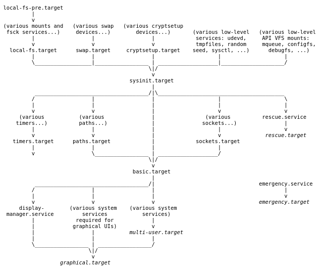
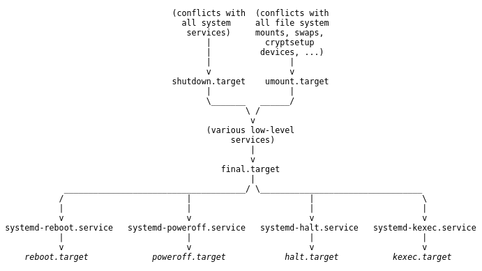

# Proyecto máquina quiosco en _systemd_

Adrià Soto Tórtola

2 ASIX

Curso 2017-2018

---

## ¿Qué es _systemd?

* Es un gestor del sistema y de los servicios para _Linux_.

* Se ejecuta como _PID_ 1.

* Inicia el resto del sistema: monta los sistemas de ficheros, inicia los servicios, etc.


## Características

* Los servicios se inician de forma paralela.

* Implementa un sistema de dependencias entre las unidades.

* Utiliza la activación de _socket_ y _D-Bus_ para iniciar los servicios y permite el inicio de los demonios bajo demanda.

* Realiza un seguimiento de los procesos utilizando los grupos de control de _Linux_.

---

## _systemd_ vs _sysvinit_

Por muchos años, el _PID_ 1 de _Linux_ y _Unix_ ha sido el proceso _Init_.

Este proceso era el responsable de la activación de los servicios en el sistema. Normalmente, los demonios eran iniciados en el arranque por _System V_ y los _scripts_ de _Init_.

Algunas de las mejoras que ofrece son:

- Se ha mejorado la velocidad de inicialización del sistema.

- Es modular, esto quiere decir que varios servicios pueden ser administrados de forma conjunta.

- Ha dejado de utilizar el fichero _/etc/inittab_.

---

## ¿Qué son las unidades?

_systemd_ se basa en la noción de unidades, compuestas de un nombre y una extensión que indica de qué tipo de unidad se trata.

Los archivos de configuración de las unidades se cargan desde dos ubicaciones. De menor a mayor precedencia son:

* _/usr/lib/systemd/system/_: unidades proporcionadas por paquetes instalados.

* _/etc/systemd/system/_: unidades instaladas por el administrador del sistema.

---

## Tipos de unidades

- _.service_

- _.target_

- _.socket_

- _.slice_

- _.mount_

- _.automount_

- _.device_

- _.swap_

- _.path_

- _.timer_

- _.snapshot_

- _.scope_

---

## Las secciones de los ficheros de unidad

La estructura interna de los ficheros de unidad se organiza en secciones.

1. La sección _[Unit]_

2. La sección _[Service]_/_[Socket]_

3. La sección _[Install]_ (opcional)

---

## _Type=simple_ (por defecto)

```
[Unit]
Description=Servidor Echo
Documentation=https://github.com/adriisotuu
After=network.target

[Service]
Type=simple
ExecStart=/usr/bin/python /bin/echo_server_multi.py
ExecStop=/usr/bin/kill -TERM $MAINPID

[Install]
WantedBy=multi-user.target
```

---

## _Type=idle_ 

```
[Unit]
Description=Servidor Telnet
Documentation=https://github.com/adriisotuu
After=network.target

[Service]
Type=idle
ExecStart=/usr/bin/python /bin/telnet-server.py
ExecStop=/usr/bin/kill -TERM $MAINPID

[Install]
WantedBy=multi-user.target
```

---

## _Type=forking_

```
[Unit]
Description=Servidor que genera ficheros .log en /tmp/ 
que contienen el output de la orden ps ax. Formato: 
ps-IPCliente-Timestamp.log
Documentation=https://github.com/adriisotuu
After=network.target

[Service]
Type=forking
PIDFile=/var/run/server-psax.pid
ExecStart=/usr/bin/python /bin/server-psax.py
ExecStop=/usr/bin/kill -TERM $MAINPID

[Install]
WantedBy=multi-user.target
```

---

## _Type=notify_

```
[Unit]
Description=Servidor Daytime
Documentation=https://github.com/adriisotuu
After=network.target

[Service]
Type=notify
NotifyAccess=main
ExecStart=/usr/bin/python /bin/daytime_server.py
ExecStop=/usr/bin/kill -TERM $MAINPID

[Install]
WantedBy=multi-user.target
```

---

## _Type=dbus_

_D-Bus_ (_Desktop Bus_) es un sistema de comunicación entre procesos (_IPC_) para aplicaciones de software con el fin de comunicarse entre sí.

El servicio se considera listo cuando el _BusName=_ especificado aparece en el bus de sistema _DBus_.

Un ejemplo de este tipo de servicio es _NetworkManager.service_.

---

## _Type=oneshot_

```
[Unit]
Description=Servicio que envia un e-mail al iniciar el sistema. 
El e-mail contiene la hora de inicio del sistema.
Documentation=https://github.com/adriisotuu
After=network.target sendmail.service

[Service]
Type=oneshot
ExecStart=/usr/bin/python /bin/enviar-email.py

[Install]
WantedBy=multi-user.target
```

---

## Los _targets_ de _systemd_ (_runlevels_)

* _poweroff.target_, _runlevel0.target_: Detiene el sistema.

* _rescue.target_, _runlevel1.target_: Modo de usuario único.

* _runlevel2.target_, _runlevel4.target_, _multi-user.target_: Definidos por el usuario. Por defecto, idéntico a _multi-user.target_.

* _multi-user.target_, _runlevel3.target_: Multiusuario, no gráfica. Los usuarios, por lo general, pueden acceder a través de múltiples consolas o a través de la red.

* _graphical.target_, _runlevel5.target_: Multiusuario, gráfica. Es decir, _multi-user.target_ + inicio de sesión gráfica.

* _reboot.target_, _runlevel6.target_: Reinicia el sistema.

* _emergency.target_: Consola de emergencia.

---

## ¿Qué default.target está utilizando nuestro sistema?

`$ systemctl get-default`


## ¿Cómo cambiar el target por defecto al arrancar el sistema?

`systemd.unit=multi-user.target`


## Modificar el _default.target_ 

`# systemctl set-default multi-user.target`


## Aislar _targets_ (_isolating_)

Es posible iniciar todas las unidades asociadas con un _target_ y detener todas las unidades que no forman parte del árbol de dependencias.

`# systemctl isolate multi-user.target`

---

## Inicio



---

## Apagado



---

## _Type=oneshot_

```
[Unit]
Description=Servicio que va anotando la fecha y hora 
del apagado del sistema (poweroff) en el fichero 
/root/control_system_shutdown.txt
Documentation=https://github.com/adriisotuu
DefaultDependencies=no
Before=systemd-poweroff.service
Conflicts=reboot.target halt.target

[Service]
Type=oneshot
ExecStart=/bin/hora-poweroff.sh

[Install]
WantedBy=poweroff.target
```

---

## _Type=oneshot_

```
[Unit]
Description=Servicio que va anotando la fecha y hora 
del reinicio del sistema (reboot) en el fichero 
/root/control_system_shutdown.txt
Documentation=https://github.com/adriisotuu
DefaultDependencies=no
Before=systemd-reboot.service
Conflicts=poweroff.target halt.target

[Service]
Type=oneshot
ExecStart=/bin/hora-reboot.sh

[Install]
WantedBy=reboot.target
```

---

## _Type=oneshot_

```
[Unit]
Description=Servicio que realiza un backup del directorio 
/boot (/root/backup-boot_dir.tar.gz) al apagar o reiniciar 
el sistema.
Documentation=https://github.com/adriisotuu

[Service]
Type=oneshot
RemainAfterExit=yes
#No hace nada, sale con un código de estado que indica éxito (success)
ExecStart=/bin/true
ExecStop=/bin/backup-shutdown.sh

[Install]
WantedBy=multi-user.target
```

---

## _Type=oneshot_

```
[Unit]
Description=Servicio que realiza un backup del directorio 
/boot (/root/backup-boot_dir.tar.gz) al apagar o reiniciar 
el sistema.
Documentation=https://github.com/adriisotuu
DefaultDependencies=no
Before=systemd-poweroff.service systemd-reboot.service

[Service]
Type=oneshot
ExecStart=/bin/backup-shutdown.sh

[Install]
WantedBy=shutdown.target
```

---

## ¿Qué es _getty_?

- Es un programa que gestiona una línea de terminal y su terminal conectada.

- Su función es la de proteger al sistema de accesos no autorizados. Generalmente, cada proceso _getty_ es iniciado por _systemd_ y gestiona una sola línea de terminal.

- _agetty_ es el _getty_ por defecto en _Arch Linux_. Básicamente, lo que hace es abrir un puerto _tty_, solicitar un _login_ e invocar el comando `/bin/login`.


## Unidades _getty@.service_ y _serial-getty@.service_

1. _getty@.service_ es responsable de los _login prompts_ del terminal virtual (_/dev/tty1_).

2. _serial-getty@.service_ es responsable de todos los demás terminales, incluyendo puertos seriales como _/dev/ttyS0_ (opción _kernel_ `console=ttyS0`).

---

## Las unidades de plantilla (_template_)

Los archivos de unidades de plantilla permiten que _systemd_ direccione varias unidades desde un solo archivo de configuración. Es decir:

* _getty@.service_: unidad de plantilla

* _getty@tty1.service_, _getty@tty3.service_, etc: instancias de la unidad de plantilla

Se utilizan dos especificadores en el fichero de la unidad para pasar el argumento de instancia:

* _%i_ pasa el identificador de instancia literalmente sin escapar.

* _%I_ pasa el identificador de instancia a través de un simple _unescaping algorithm_.

---

## ¿Cómo funciona _getty@.service_?

- Los _login prompts_ se inician sólo bajo demanda a medida que el usuario cambia a terminales virtuales no utilizadas.

- Los servicios _autovt_ se generan automáticamente y estos se instancian desde la unidad de plantilla _autovt@.service_ para el nombre correspondiente (_autovt@tty4.service_).

- _autovt@.service_ es un enlace simbólico que apunta a _getty@.service_.

- Ahorramos un poco de recursos y la puesta en marcha es un poco más rápida.

- Por defecto, este _spawning_ automático se realiza para las _TTVV_ hasta la _tty6_ sólamente.

---

## ¿Cómo cambiar el número de _gettys_ ejecutados por defecto?

1. Editando el fichero _/etc/systemd/logind.conf_ y cambiando el valor de _NAutoVTs_ (activación bajo demanda)

Si queremos que todas las teclas _[Fx]_ inicien un _getty_, simplemente hay que aumentar el valor de _NAutoVTs_ a 12.

2. Creando enlaces simbólicos en _/etc/systemd/system/getty.target.wants/_

Con este método podemos añadir _gettys_ preactivados, los cuales serán ejecutados y estarán funcionando desde el arranque.

```
# systemctl enable getty@tty8.service getty@tty9.service
# systemctl start getty@tty8.service getty@tty9.service
```


## ¿Cómo iniciar terminales virtuales temporales?

`# systemctl start getty@ttyN.service`

---

## La unidad _user@.service_

- El módulo _pam_systemd.so_ inicia automáticamente una instancia `systemd --user` cuando el usuario inicia sesión por primera vez, iniciando _user@.service_.

- Por lo tanto, la instancia `systemd --user` es un proceso por usuario y no por sesión.

- `systemd --user` se ejecuta como un proceso separado del proceso `systemd --system`.

- Las unidades de usuario no pueden referirse o depender de las unidades del sistema.

- Con `$ systemctl --user status` nos aseguramos de que la instancia de usuario se ha iniciado correctamente.

---

## Directorios donde se encuentran las unidades de usuario

1. _~/.config/systemd/user/_ donde el usuario pone sus propias unidades.

2. _/etc/systemd/user/_ donde el administrador del sistema coloca las unidades de usuario de todo el sistema (_system-wide_).

3. _~/.local/share/systemd/user/_ donde pertenecen las unidades de paquetes que se han instalado en el directorio _/home/_ del usuario.

4. _/usr/lib/systemd/user/_ donde pertenecen las unidades provistas por paquetes instalados.

---

## Inicio automático de instancias de usuario _systemd_

`# loginctl enable-linger username`


## El fichero _/etc/inittab_

Antes de la llegada de _systemd_, al iniciar el sistema o cambiar los niveles de ejecución, el daemon _init_ iniciaba los procesos mediante la lectura de la información del fichero _/etc/inittab_.

`id:rstate:action:process`


## ¿Cómo se restauraban (_respawn_) los procesos en _Linux_ con _init_?

`prueba:234:respawn:/bin/mplayer.sh`

Con este ejemplo siempre tendríamos una instancia del proceso _mplayer.sh_ identificado en _/etc/inittab_ por el nombre "prueba", que se encuentra en el directorio _/bin/_, en los niveles de ejecución 2, 3 y 4.

---

## _Respawn_ de los procesos en _Linux_ con _systemd_

```
[Unit]
Description=mplayer streaming con respawn automático
Documentation=https://github.com/adriisotuu
After=network.target

[Service]
Type=simple
ExecStart=/bin/mplayer.sh
ExecStop=/usr/bin/kill -TERM $MAINPID
Restart=always
RestartSec=10s

[Install]
WantedBy=multi-user.target
```

---

## Modo 1 con red

```
[Unit]
Description=Modo 1 con red.
Documentation=https://github.com/adriisotuu
Requires=rescue.target
Wants=NetworkManager.service
After=rescue.target
AllowIsolate=yes
```

---

## _quiosco.target_

```
[Unit]
Description=Target base para la creación de máquinas 
quiosco (auto-login usuario quiosco).
Documentation=https://github.com/adriisotuu
Requires=sysinit.target
Wants=dbus.service getty.target plymouth-quit.service 
plymouth-quit-wait.service systemd-logind.service 
systemd-user-sessions.service
After=sysinit.target
AllowIsolate=yes
```

---

## _Xwrapper.config_

```
allowed_users=anybody
needs_root_rights=yes
```


## _.bash\_profile_

```
# .bash_profile

# Get the aliases and functions
if [ -f ~/.bashrc ]; then
	. ~/.bashrc
fi

# User specific environment and startup programs

PATH=$PATH:$HOME/.local/bin:$HOME/bin

export PATH

systemctl --user start startx@$(echo $XDG_VTNR).service
```

---

## _startx@.service_

```
[Unit]
Description=Startx con respawn automático.
Documentation=https://github.com/adriisotuu
Requires=startx@%i.socket
After=sysinit.target startx@%i.socket

[Service]
Type=simple
ExecStart=/bin/startx -- :%i -nolisten tcp vt%i
ExecStop=/usr/bin/kill -TERM $MAINPID
Restart=always
```

---

## _quiosco\_firefox.target_

```
[Unit]
Description=Quiosco Firefox
Documentation=https://github.com/adriisotuu
Requires=quiosco.target
Wants=NetworkManager.service
After=quiosco.target
AllowIsolate=yes

[Install]
Alias=runlevel2.target
```

---

## _firefox.service_

```
[Unit]
Description=Añade cliente gráfico Firefox en segundo plano 
en /home/quiosco/.xinitrc
Documentation=https://github.com/adriisotuu
Before=window_manager.service

[Service]
Type=oneshot
ExecStart=/bin/firefox_xinitrc.sh

[Install]
WantedBy=quiosco_firefox.target
```


## _firefox\_xinitrc.sh_

```
#!/bin/sh

echo "firefox -P -new-tab https://www.google.es &" > 
/home/quiosco/.xinitrc
```

---

## _window\_manager.service_

```
[Unit]
Description=Añade Window Manager en primer plano 
en /home/quiosco/.xinitrc
Documentation=https://github.com/adriisotuu

[Service]
Type=oneshot
ExecStart=/bin/wm_xinitrc.sh

[Install]
WantedBy=quiosco_firefox.target
```


## _wm\_xinitrc.sh_

```
#!/bin/sh

echo "exec mutter" >> /home/quiosco/.xinitrc
```

